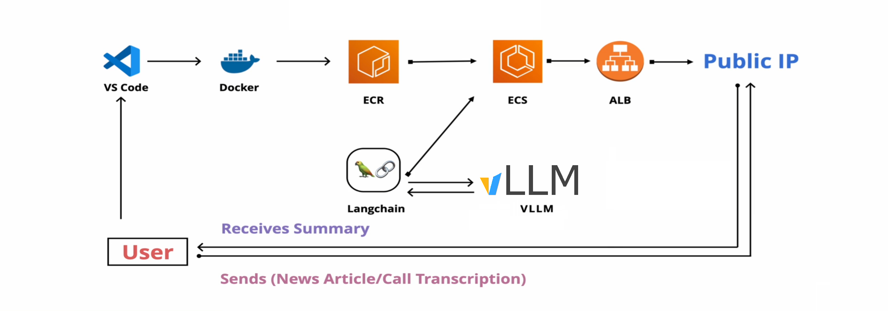

## 🚀☁️ LLM Serving & Scaling Showcase — vLLM Inference at Scale

## 📌 Project Overview

This repository demonstrates a **minimal viable product (MVP)** for serving open‑source LLMs using **vLLM** with an **OpenAI‑compatible API**, and providing a **Streamlit UI** for interaction.  
It is designed to be lightweight for local testing, yet structured to evolve into a **production‑grade deployment** on AWS ECS (Fargate).

---

## 🛠 Tech Stack

- **vLLM** → Efficient inference engine with OpenAI API compatibility  
- **LangChain** → Orchestration of summarization pipeline  
- **Streamlit** → Interactive UI for text input and results  
- **Docker** → Containerization for reproducible environments  
- **Docker Compose** → Local orchestration of multi‑container setup  
- **AWS ECR** → Container image registry for production deployment  
- **AWS ECS (Fargate)** → Serverless container orchestration, GPU‑ready for vLLM  
- **Elastic Load Balancer** → Distribute traffic across multiple containers  
- **CloudWatch** → Monitoring, logging, and health checks for services  

---

## ⚡ Quick Start

### 1. Local Run (seperated containers)
Build and run the Streamlit app:
```bash
docker build -t streamlit-app ./streamlit-app
docker run -p 8501:8501 streamlit-app
```

Start vLLM server separately:
```bash
docker build -t vllm-server ./vllm-server
docker run --gpus all -p 8000:8000 vllm-server
```

Visit the UI in your browser:
```
http://localhost:8501
```

### 2. Local Run (docker-compose)
Spin up both containers together:
```bash
docker-compose up --build
```

Access the UI:
```
http://localhost:8501
```

---

## 🏗️ Architecture

<div align="center">
  
  <p><em>System Architecture</em></p>
</div>

---

## 🔜 Next Steps

The next milestone is **AWS ECS (Fargate) deployment**, transforming this MVP into a scalable production setup. Planned features include:
- **AWS ECR** → Store and manage container images  
- **AWS ECS (Fargate)** → Serverless container orchestration  
- **Elastic Load Balancer** → Distribute traffic across multiple containers  
- **Auto Scaling** → Dynamically adjust capacity based on demand  
- **CloudWatch Monitoring** → Health checks, logging, and metrics  
